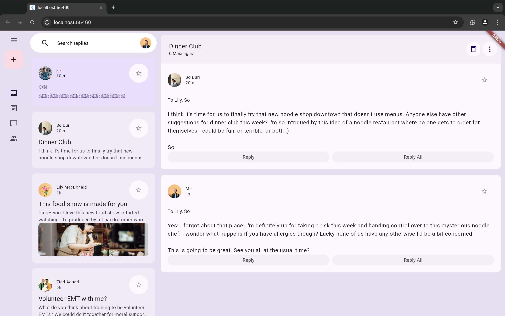

# Flutter Responsive Layout

## Descripción

Este proyecto es una aplicación Flutter que implementa un diseño responsivo, adaptándose a diferentes tamaños de pantalla. Utiliza animaciones personalizadas y componentes de Material Design para ofrecer una experiencia de usuario atractiva y fluida.



## Funcionalidades

- Diseño responsivo que se adapta a pantallas pequeñas y grandes.
- Animaciones suaves al navegar entre diferentes vistas.
- Uso de Material Design para una mejor experiencia de usuario.
- Vista de correos electrónicos con la opción de respuesta.

## Requisitos

- Flutter 3.24.4 o superior
- Dart 2.19.0 o superior
- Java 17 (OpenJDK)

## Instalación

1. Clona el repositorio:

   ```bash
   git clone https://github.com/AzulRK22/flutter-responsive.git
2. Navega al directorio del proyecto:
   
       cd flutter-responsive
   
3. Instala las dependencias:

       flutter pub get
   
4. Ejecuta la aplicación:
   
       flutter run
   
## Estructura del Proyecto
    flutter-responsive/
    ├── lib/
    │   ├── animations/                     # Contiene las animaciones personalizadas
    │   ├── models/                         # Modelos de datos utilizados en la aplicación
    │   ├── widgets/                        # Componentes de interfaz de usuario
    │   ├── main.dart                       # Punto de entrada de la aplicación
    │   └── ...
    ├── pubspec.yaml                        # Archivo de configuración del proyecto
    └── ...
## Contribución

Si deseas contribuir a este proyecto, siéntete libre de abrir un issue o un pull request. Asegúrate de seguir las mejores prácticas de programación.

## Licencia

Este proyecto está bajo la Licencia MIT - ver el archivo LICENSE para más detalles.

## Autor

Azul Grisel Ramirez Kuri
